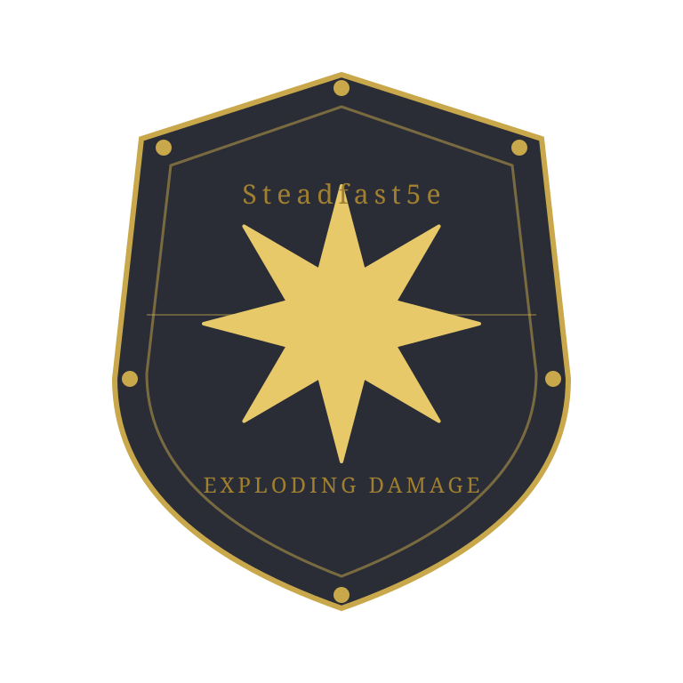

# Steadfast5e - Exploding Damage

**FG Forge Listing:** not yet published

Part of the [Steadfast5e](https://forge.fantasygrounds.com/) suite for grittier, OSR-style 5E play.

## What it does

Classic exploding-dice house rule for **all** damage rolls — weapons and spells alike. When a damage die rolls its maximum possible value, it rerolls and adds the new result to the total, repeating if the reroll also explodes.

Every damage roll has each of its dice flagged to use FGU's own native **compound-explode** die mode before the roll happens. Concretely: a `2d6` damage roll becomes, mechanically, the equivalent of rolling `2d6!` — any die that lands on its maximum value (a 6 on a d6, a 4 on a d4, etc.) is automatically rerolled and the new result is added to that die's total, chaining for as long as it keeps exploding.

This isn't custom reroll logic built for this extension — it's a real, existing FGU/CoreRPG dice-engine feature (the same one 5E's own "Vorpal" weapon property equivalent in 4E, and Shadowdark's "Momentum" feature, use), just switched on for every 5E damage roll instead of gated behind a specific weapon property.

### What This Means in Practice

- **Weapon damage** — melee and ranged, PC and NPC — explodes.
- **Spell damage** — any power/spell dealing damage via the standard damage action — explodes.
- **Normal (non-max) rolls** are completely unaffected — no extra dice, no message changes, until a die actually lands on its maximum.

## How It Works

Every 5E damage roll — PC/NPC weapon attacks and spell/power damage alike — ultimately funnels through a single CoreRPG function: `ActionDamageD20.getRoll(rActor, rAction)`. This extension monkey-patches that one function: before delegating to the original, it walks `rAction.clauses` (the list of damage components — base weapon dice, ability modifier, magic weapon bonus, etc.) and sets `bExplodeCompound = true` on each one. CoreRPG's own dice builder (`DiceRollManager.addDamageDice`, called from within `getRoll`) already reads that flag per clause and sets each die's native `"e!"` (compound explode) mode — the extension never touches dice results directly or reimplements the reroll-and-add logic itself.

A single patch point is enough here: `ActionDamageD20.performRoll` (used by weapon attacks) calls `ActionDamageD20.getRoll` internally through the same fully-qualified alias, so patching `getRoll` alone covers weapon damage, NPC weapon damage, and spell/power damage (which calls `getRoll` directly to batch into a multi-roll action) in one place.

## Known Limitation: Critical Hits

5E's default critical-hit rule (dice-doubling) is implemented in a shared CoreRPG function (`ActionDamageD20.applyModCriticalDoubleDice`) that builds a fresh set of doubled dice but does not carry the `bExplodeCompound` flag over to them. In practice this means: on a critical hit, the **original** dice in a damage roll will still explode normally, but the **extra doubled dice** added by the critical-hit rule will not themselves explode. This is a gap in that stock CoreRPG function, not something this extension can fix without editing a shared CoreRPG file — which this project avoids on principle. Worth revisiting if it turns out to matter in play.

## Compatibility

- D&D 5E 2014 (Legacy) and 2024
- Compatible with other Steadfast5e extensions
- No stock ruleset file is edited — a single monkey-patch of `ActionDamageD20.getRoll`, reusing FGU's own native exploding-dice die mode rather than any custom logic

## Installation

Drop the `steadfast5e_expdmg` folder into your Fantasy Grounds Unity `extensions/` directory and enable it when loading a 5E campaign.
